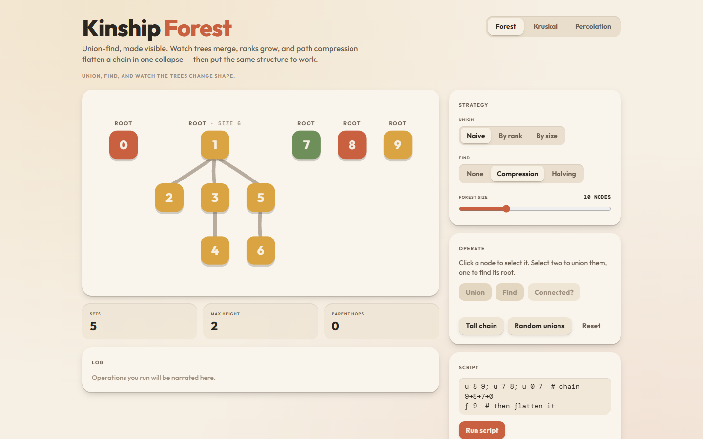
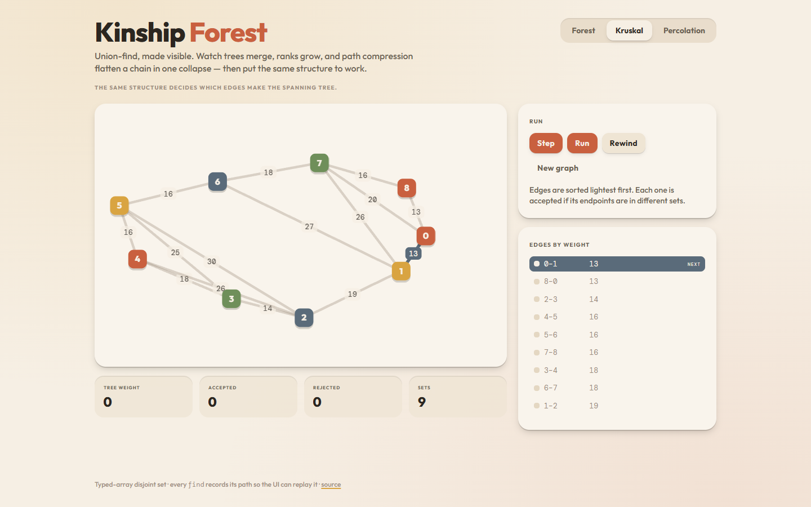
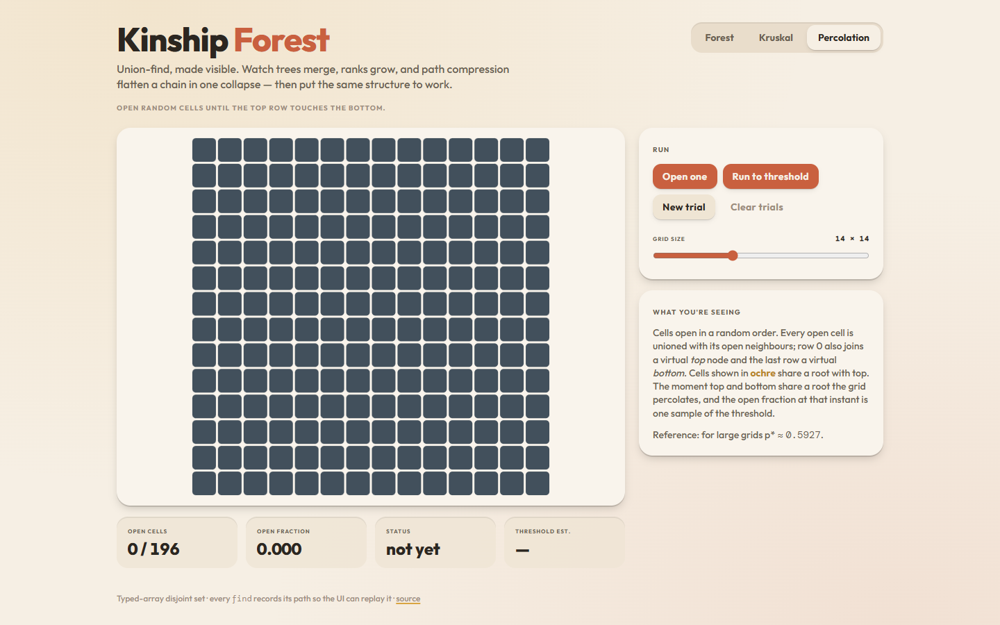

# Kinship Forest

Union-find made visible: watch trees merge, ranks grow, and path compression flatten chains, then use it to run Kruskal and percolation demos.



The money shot: press **Tall chain**, then **Find 9**. The walk climbs the chain one node at a time, and when it reaches the root every node it visited snaps sideways to hang directly off the root in one animated collapse, with an arc drawn from where each node used to be.

## Features

- **Three union strategies** — naive, union by rank, union by size — switchable live, plus **path compression**, **path halving** or no compression on `find`.
- **Forest view** — each set is a tidy tree of chunky rounded nodes; a union slides one root under another, roots show their rank or size.
- **Find animation** — the walk to the root is highlighted step by step, then the reparenting done by compression is drawn as arcs while the nodes glide into their new positions.
- **Kruskal mode** — a random weighted graph; edges are considered lightest first, accepted edges glow ochre and cycle-forming edges shake and dash out. Node colours replay the merging components.
- **Percolation mode** — an N x N grid opened one random cell at a time until the top row connects to the bottom; the open fraction at that moment is one sample of the percolation threshold, averaged across trials.
- **Stats** — number of sets, height of the tallest tree, and total parent-pointer hops performed so far.
- **Scripted operations** — type `u 1 2; f 5; c 1 5` (or `union`, `find`, `connected`) for reproducible demos; `#` starts a comment, Ctrl+Enter runs.
- Keyboard operable throughout (nodes are focusable buttons, tabs use arrow keys), respects `prefers-reduced-motion`, works down to ~380px wide.

| Kruskal | Percolation |
| --- | --- |
|  |  |

## How it works

The core is a plain `UnionFind` class over three `Int32Array`s — `parent`, `rank` and `size` — with no React in sight (`src/core/unionFind.ts`). What makes it visualisable is that `find` does not just return a root: `findTrace(x)` returns the full path it walked and every parent pointer it rewrote along the way. The UI replays the path as a stepped walk against a snapshot of the *old* parent array, then swaps in the new parent array and lets CSS transitions on each node's `transform` carry it to its new position. The `reparented` list is what draws the arcs.

```
before find(4)            after find(4) with full compression
                          
  0                          0
  |                        / | \ \
  1                       1  2  3  4      path     = [4, 3, 2, 1, 0]
  |                                       reparent = 4->0, 3->0, 2->0
  2                       with halving instead:
  |                          0
  3                         / \
  |                        1   2          path     = [4, 2, 0]
  4                            / \        reparent = 4->2, 2->0
                              3   4
```

Union looks up both roots, then decides which hangs under which. Naive always hangs `b`'s root under `a`'s. By rank keeps the taller tree on top and only bumps the rank when two equally tall trees meet, which is why the tallest tree stays O(log n). By size does the same with node counts. Because the strategy is just three flags on the instance, the app lets you flip them mid-demo and watch the same operations produce a different forest.

Both applications reuse that class untouched. **Kruskal** sorts the edge list with a hand-written stable merge sort and walks it lightest first: `union(u, v)` returning `true` means the edge joined two components and belongs in the tree; `false` means both ends already shared a root, so the edge would close a cycle. **Percolation** models an N x N grid as N*N nodes plus two virtual ones, TOP and BOTTOM; opening a cell unions it with its open neighbours (and with TOP or BOTTOM on the edge rows), and the grid percolates the instant `connected(TOP, BOTTOM)` holds. A second structure without BOTTOM answers "is this cell full?" so a percolating grid does not wash fullness back into cells that only touch the bottom.

## Run it

```sh
npm install
npm run dev        # local dev server
npm run build      # type-check + production build to dist/
npm test           # vitest: union-find, kruskal, percolation, layout, script parser
npm run lint       # oxlint
```

Deep links: `?mode=kruskal` and `?mode=percolation`.

## Tech

React 19, TypeScript (strict), Vite 8, Tailwind CSS 4, Vitest 5. Typography is Outfit and DM Mono via `@fontsource`. Everything is drawn as inline SVG; no charting or animation libraries.

## License

MIT — see [LICENSE](LICENSE).
